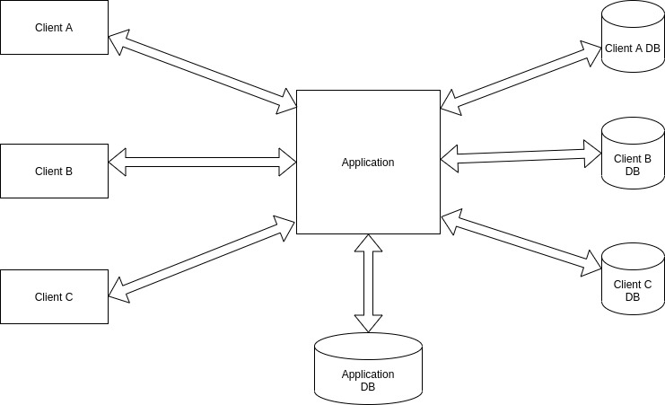

 ###Multi-Tenant Architecture

This repo contains the implementation of multi-tenant architecture 
with separate database for each client. Each client interacts with same software application
with separate database underneath.Each client database information is stored in Application database.

The technologies used are **Java**, **Spring Boot**, **JPA/Hibernate**, **MyBatis**, **PostgresSql**.

